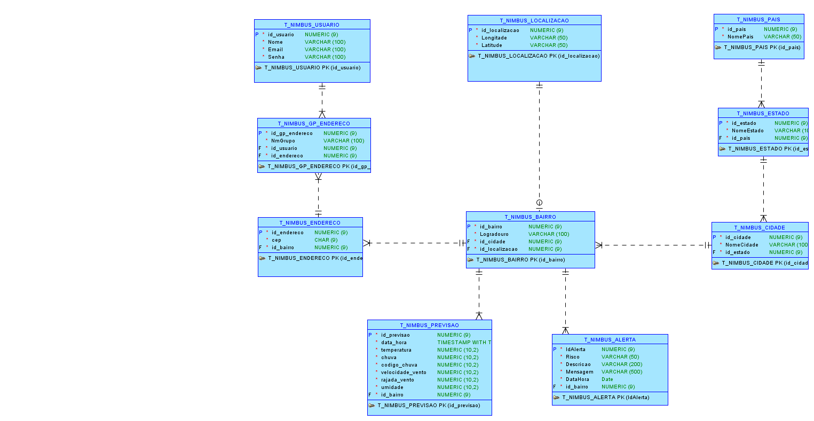

# NimbusApi

## Visão Geral
Nossa solução para a Global Solution consiste em uma aplicação voltada para a previsão de possíveis desastres naturais, levando em consideração a localização do usuário.

A aplicação coleta dados atualizados da previsão do tempo e a posição geográfica do usuário, utilizando essas informações junto a um modelo de inteligência artificial para prever a chance de ocorrência de desastres naturais em sua região.

Com base nessa previsão, o sistema envia alertas classificados em três níveis: baixo, médio e grave permitindo avisar cada pessoa com precisão e antecedência.

Além disso, o usuário poderá adicionar grupos de localização, como a casa de familiares, o local de trabalho ou outros pontos de interesse. Dessa forma, ele receberá alertas personalizados para essas regiões também, ajudando na prevenção e no planejamento diante de possíveis enchentes ou outros eventos climáticos extremos.

## Video demonstrativo
- https://youtu.be/EK676Obg-t0

## Vídeo Pitch
- https://www.youtube.com/watch?v=Cky07rBTRaE

## Estrutura do Projeto

- **Controllers/**: Camada de entrada da API, responsável por receber e responder às requisições HTTP.
- **Models/**: Classes que representam as entidades do domínio (ex: Usuario, Alerta, Bairro, Estado, etc).
- **Services/**: Camada de lógica de negócio, responsável por validar e processar as operações.
- **Repository/**: Camada de acesso a dados, responsável pela comunicação com o banco de dados.
- **Validations/**: Classes de validação para garantir integridade dos dados.
- **Connection/**: Configuração do contexto do banco de dados (Entity Framework).
- **Exceptions/**: Exceções customizadas para tratamento de erros.

## Desenvolvimento

O projeto utiliza o **Entity Framework Core** para acesso a dados e segue o padrão de arquitetura em camadas (Controller → Service → Repository).

### Principais Funcionalidades

- Cadastro, consulta, atualização e remoção de usuários, alertas, endereços, bairros, cidades, estados, previsões, países e grupos de endereço.
- Validações robustas para garantir integridade dos dados.
- Tratamento de exceções customizadas para respostas claras ao cliente.

### Tecnologias Utilizadas

- .NET 9.0
- Entity Framework Core
- Oracle Database (conforme string de conexão em `appsettings.json`)
- ASP.NET Core Web API

## Diagrama Lógico

Abaixo está o diagrama lógico da arquitetura do sistema, ilustrando a relação entre as principais entidades e camadas da aplicação:




## Instruções para Acesso

### Pré-requisitos

- .NET SDK 9.0 ou superior
- Acesso ao banco de dados Oracle

### Como Executar

1. Clone o repositório:
    ```sh
    git clone https://github.com/GSNimbus/DotNet
    cd NimbusApi/NimbusApi
    ```

2. Restaure os pacotes e compile:
    ```sh
    dotnet restore
    dotnet build
    ```

3. Execute a aplicação:
    ```sh
    dotnet run
    ```

4. Acesse a API via [http://localhost:7216](http://localhost:7216)
5. Acesso ao swagger em: [http://localhost:7216/swagger/index.html](http://localhost:7216/swagger/index.html)

### Endpoints Principais

- `GET https://localhost:7216/api/Usuario` — Lista todos os usuários
- `POST https://localhost:7216/api/Usuario` — Cria um novo usuário
- `POST https://localhost:7216/api/Usuario/postAll` — Cria um novo usuário com dados completos
- `GET https://localhost:7216/api/Usuario/{id}` — Busca usuário por ID
- `GET https://localhost:7216/api/Usuario/email/{email}` — Busca usuário por e-mail

- `GET https://localhost:7216/api/Alerta` — Lista todos os alertas
- `GET https://localhost:7216/api/Alerta/{id}` — Busca alerta por ID
- `POST https://localhost:7216/api/Alerta` — Cria um novo alerta
- `PUT https://localhost:7216/api/Alerta/{id}` — Atualiza um alerta
- `DELETE https://localhost:7216/api/Alerta/{id}` — Remove um alerta

- `GET https://localhost:7216/api/Endereco` — Lista todos os endereços
- `GET https://localhost:7216/api/Endereco/{id}` — Busca endereço por ID
- `GET https://localhost:7216/api/Endereco/cep/{cep}` — Busca endereço pelo CEP
- `POST https://localhost:7216/api/Endereco` — Cria um novo endereço
- `PUT https://localhost:7216/api/Endereco/{id}` — Atualiza um endereço
- `DELETE https://localhost:7216/api/Endereco/{id}` — Remove um endereço

- `GET https://localhost:7216/api/Bairro` — Lista todos os bairros
- `GET https://localhost:7216/api/Bairro/{id}` — Busca bairro por ID
- `GET https://localhost:7216/api/Bairro/nome/{nomeBairro}` — Busca bairro por nome
- `POST https://localhost:7216/api/Bairro` — Cria um novo bairro
- `PUT https://localhost:7216/api/Bairro/{id}` — Atualiza um bairro
- `DELETE https://localhost:7216/api/Bairro/{id}` — Remove um bairro

- `GET https://localhost:7216/api/Estado` — Lista todos os estados
- `GET https://localhost:7216/api/Estado/{id}` — Busca estado por ID
- `GET https://localhost:7216/api/Estado/nome/{nomeEstado}` — Busca estado por nome
- `POST https://localhost:7216/api/Estado` — Cria um novo estado
- `PUT https://localhost:7216/api/Estado/{id}` — Atualiza um estado
- `DELETE https://localhost:7216/api/Estado/{id}` — Remove um estado

- `GET https://localhost:7216/api/Cidade` — Lista todas as cidades
- `GET https://localhost:7216/api/Cidade/{id}` — Busca cidade por ID
- `GET https://localhost:7216/api/Cidade/nome/{nomeCidade}` — Busca cidade por nome
- `POST https://localhost:7216/api/Cidade` — Cria uma nova cidade
- `PUT https://localhost:7216/api/Cidade/{id}` — Atualiza uma cidade
- `DELETE https://localhost:7216/api/Cidade/{id}` — Remove uma cidade

- `GET https://localhost:7216/api/Localizacao` — Lista todas as localizações
- `GET https://localhost:7216/api/Localizacao/{id}` — Busca localização por ID
- `POST https://localhost:7216/api/Localizacao` — Cria uma nova localização
- `PUT https://localhost:7216/api/Localizacao/{id}` — Atualiza uma localização
- `DELETE https://localhost:7216/api/Localizacao/{id}` — Remove uma localização

- `GET https://localhost:7216/api/Pais` — Lista todos os países
- `GET https://localhost:7216/api/Pais/{id}` — Busca país por ID
- `GET https://localhost:7216/api/Pais/nome/{nomePais}` — Busca país por nome
- `POST https://localhost:7216/api/Pais` — Cria um novo país
- `PUT https://localhost:7216/api/Pais/{id}` — Atualiza um país
- `DELETE https://localhost:7216/api/Pais/{id}` — Remove um país

- `GET https://localhost:7216/api/GpEndereco` — Lista todos os grupos de endereço
- `GET https://localhost:7216/api/GpEndereco/{id}` — Busca grupo de endereço por ID
- `GET https://localhost:7216/api/GpEndereco/nome/{nome}` — Busca grupo de endereço por nome
- `GET https://localhost:7216/api/GpEndereco/usuario/{usuarioId}` — Lista grupos de endereço por usuário
- `POST https://localhost:7216/api/GpEndereco` — Cria um novo grupo de endereço
- `PUT https://localhost:7216/api/GpEndereco/{id}` — Atualiza um grupo de endereço
- `DELETE https://localhost:7216/api/GpEndereco/{id}` — Remove um grupo de endereço

- `GET https://localhost:7216/api/Previsao` — Lista todas as previsões
- `GET https://localhost:7216/api/Previsao/{id}` — Busca previsão por ID
- `GET https://localhost:7216/api/Previsao/bairro/{id}` — Lista previsões por bairro
- `POST https://localhost:7216/api/Previsao` — Cria uma nova previsão
- `PUT https://localhost:7216/api/Previsao/{id}` — Atualiza uma previsão
- `DELETE https://localhost:7216/api/Previsao/{id}` — Remove uma previsão

- `POST https://localhost:7216/api/Previsao/prever/{idBairro}` — Realiza previsão meteorológica para um bairro (endpoint inteligente)


Consulte os controllers para mais endpoints.

## Testes

### Exemplos de Teste Manual

Você pode testar os endpoints utilizando ferramentas como **Swagger**, **Postman** ou **curl**.

#### Exemplo: Criar um novo usuário

```http
POST https://localhost:7216/api/Usuario
Content-Type: application/json

{
  "nome": "Maria",
  "email": "maria@email.com",
  "senha": "123456"
}
```

#### Exemplo: Buscar usuário por ID

```http
GET https://localhost:7216/api/Usuario/1
```

#### Exemplo: Buscar endereço por CEP

```http
GET https://localhost:7216/api/Endereco/cep/12345-678
```

